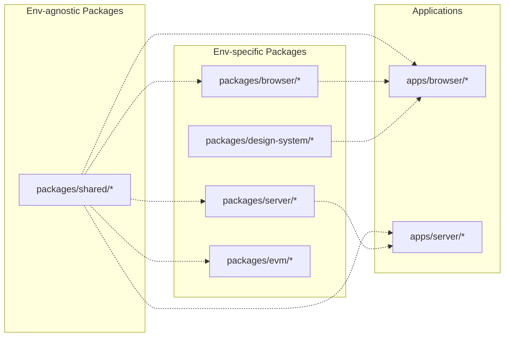

# How to contribute?

## Module Boundaries

Our eslint configuration utilise `@nx/enforce-module-boundaries` rule that enstricts imports between modules within the codebase.

The following policy had been applied across the board and any exception to that should be reflected in diagram below, plus, consulted with the team.

Nx workspace allows you to tag library, or application with tags. Those tags are later used by `@nx/enforce-module-boundaries` to deduct from project graph what imports are allowed, and what are not.

Tags used within the workspace are; 1. `package-shared`, 2. `package-browser`, 3. `package-server`, 4. `package-evm`, 5. `application-browser`, 6. `application-server`, 7. `application-evm`,
